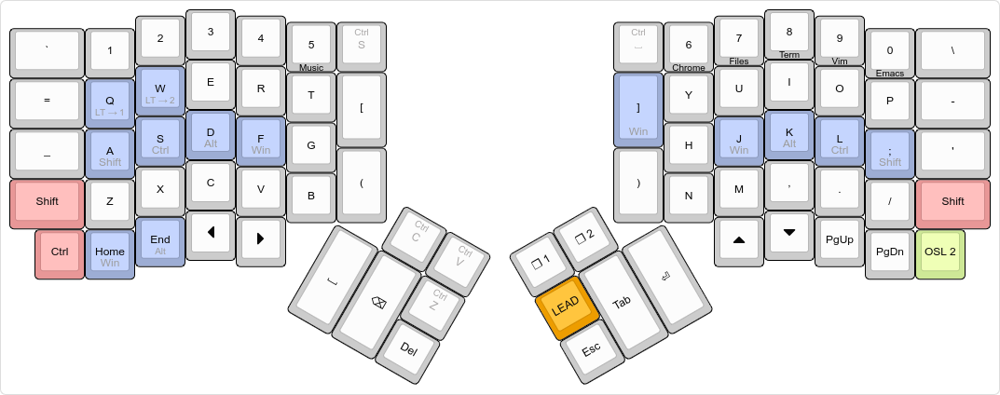
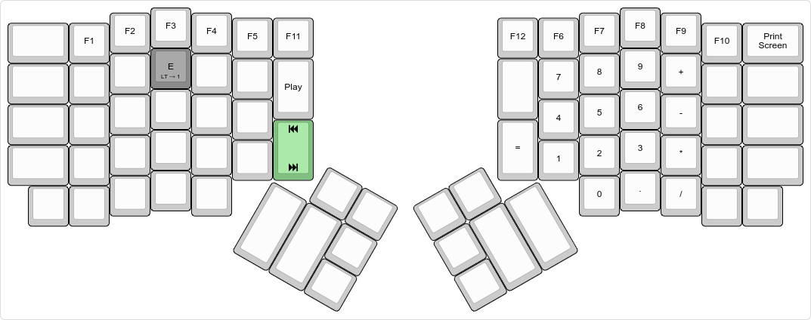
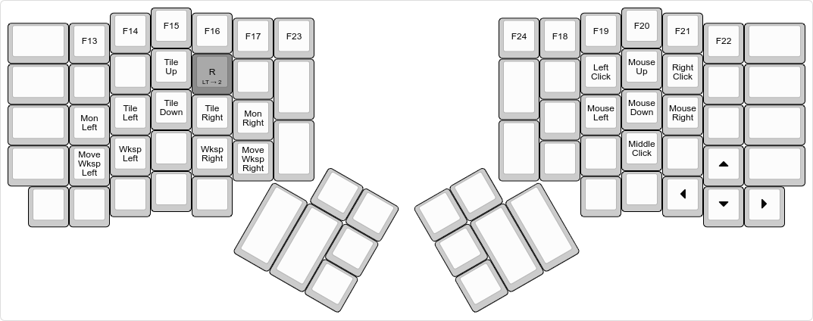

# iynaix's layout

My layout for the [ErgoDox EZ][ez], heavily inspired by [Algernon's Layout][algernon-layout]

[ez]: https://ergodox-ez.com/
[algernon-layout]: https://github.com/algernon/ergodox-layout

Some of the things in the layout only work under Linux.

# Layouts

## Base

[](http://www.keyboard-layout-editor.com/#/gists/121345505ed2f8dfb2f0733407c08076)

-   The red `Shift` and `Ctrl` modifiers are one-shot. When tapped, they are considered active for the next key press only. When double tapped, they toggle on, until a third, single tap sometime later. When held, they act as expected.
-   The blue `Shift`, `Ctrl`, `Alt` and `Win` modifiers are mod-tap keys. When tapped, they perform as expected. When held, they function as the respective modifiers.
-   The green keys are tap dance keys. Tap once for the top command, twice for the second command and thrice for the third command.
-   The `Esc` key also doubles as a one-shot cancel key: if tapped while any of the one-shot modifiers are in-flight (as in, single-tapped, and not expired yet), it cancels all one-shot modifiers. Otherwise it sends the usual keycode.
-   The number keys with lower legends run the given program in conjunction with `Win`. This is done via a [custom application switcher / launcher][wintool]. E.g. `Win 6` either launches chrome or alt-tabs between currently running chrome instances
-   The **Lead** key allows me to type in a sequence of keys, and trigger some actions:

    -   `LEAD s` types `¯\_(ツ)_/¯`
    -   `LEAD y` types `\o/`.
    -   `LEAD f` types `凸(ツ)凸`.
    -   `LEAD l` types `( ͡° ͜ʖ ͡°)`.
    -   `LEAD t` types `(╯°□°）╯︵ ┻━┻`.

    [wintool]: https://github.com/iynaix/dotfiles/blob/master/bin/wintool
    [wincompose]: https://github.com/samhocevar/wincompose

## Numpad Layer

[](http://www.keyboard-layout-editor.com/#/gists/121345505ed2f8dfb2f0733407c08076)

-   The green `Next` and `Prev` key produces a `Media Next` when single tapped and `Media Prev` when double-tapped.

## Navigation Layer

[](http://www.keyboard-layout-editor.com/#/gists/e210f0b9dc6951748a4aa7511688b79e)

Contains keys for navigation by mouse and a set of arrow keys oriented in the regular fashion.

# Building

To build it, you will need the [QMK][qmk] firmware checked out, and this directory symlinked to something like `layouts/community/ergodox/iynaix`, or symlinked there. One way to achieve that is this:

[iynaix:ez-layout]: https://github.com/iynaix/ergodox-layout
[qmk]: https://github.com/qmk/qmk_firmware

```
$ git clone https://github.com/iynaix/ergodox-layout.git
$ cd qmk_firmware
$ git clone https://github.com/iynaix/ergodox-layout.git \
            layouts/community/ergodox/iynaix
$ make ergodox_ez:iynaix:hex
$ teensy-loader-cli -v -mmcu=atmega32u4 -w ergodox_ez_iynaix.hex
```
